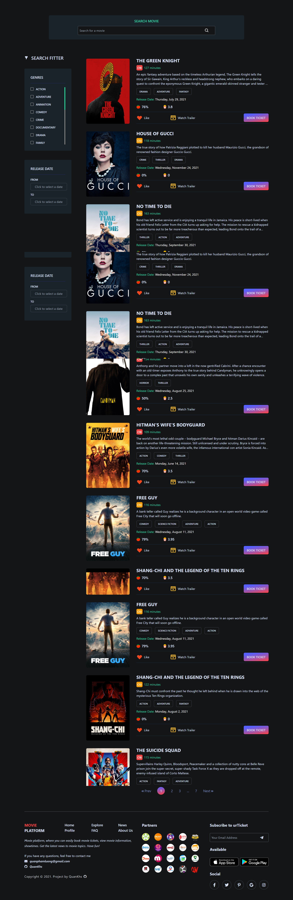
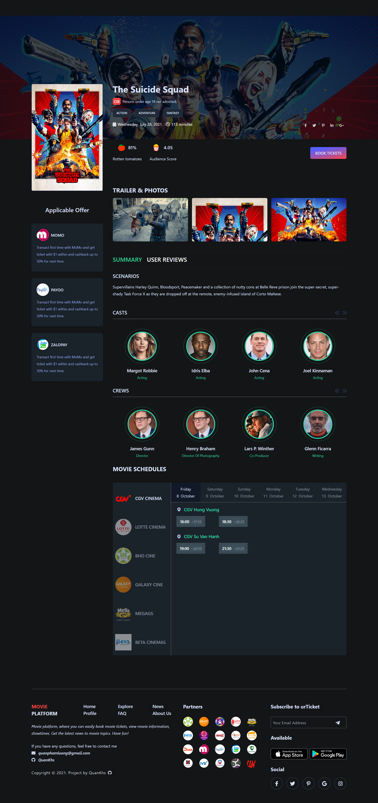
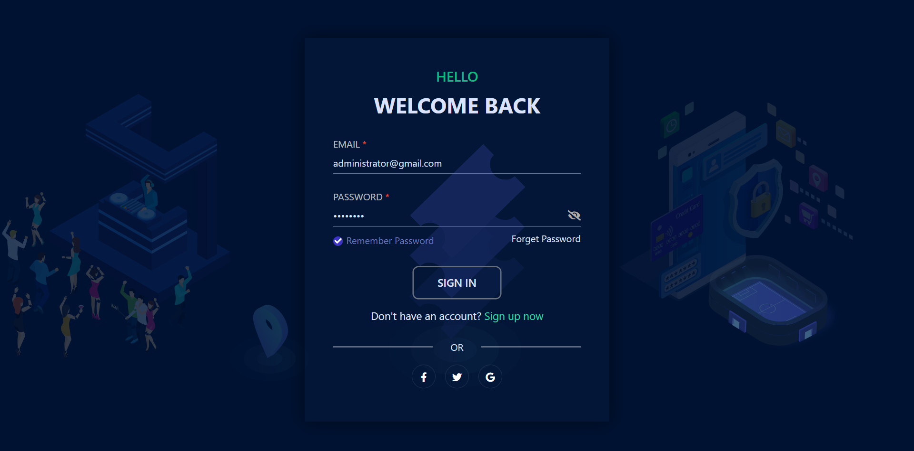
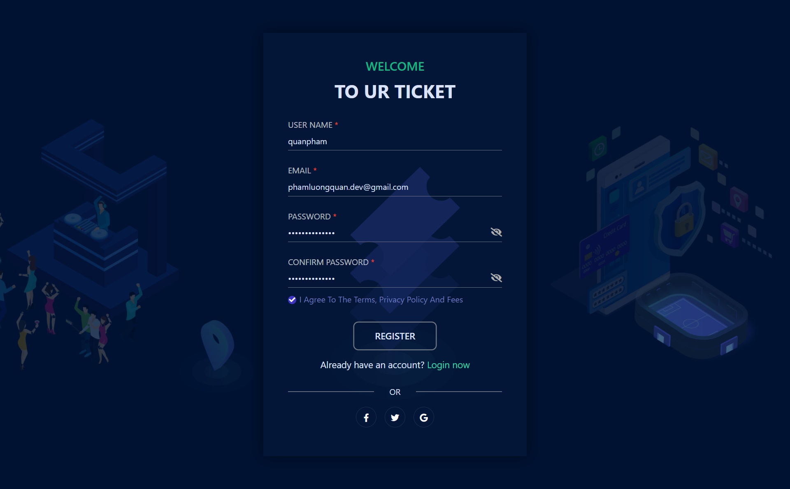
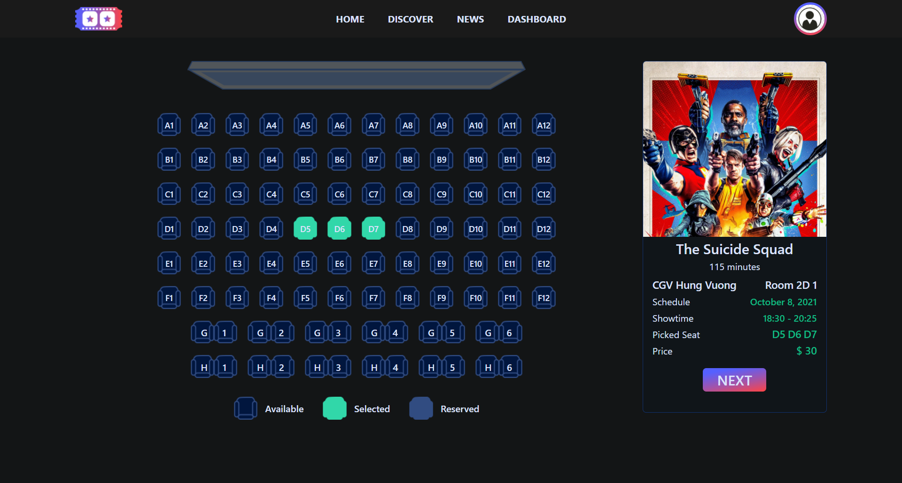
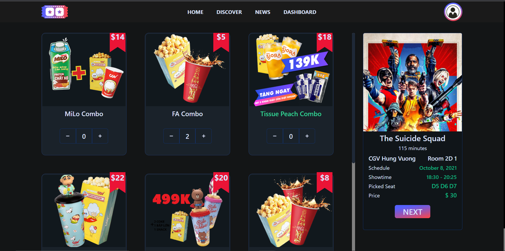
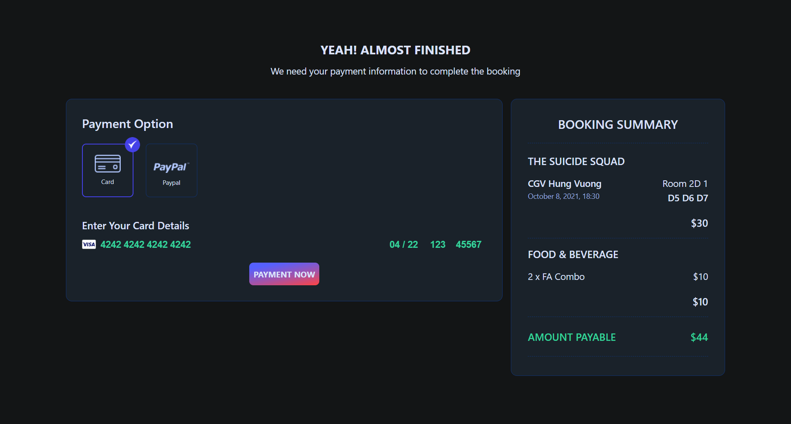
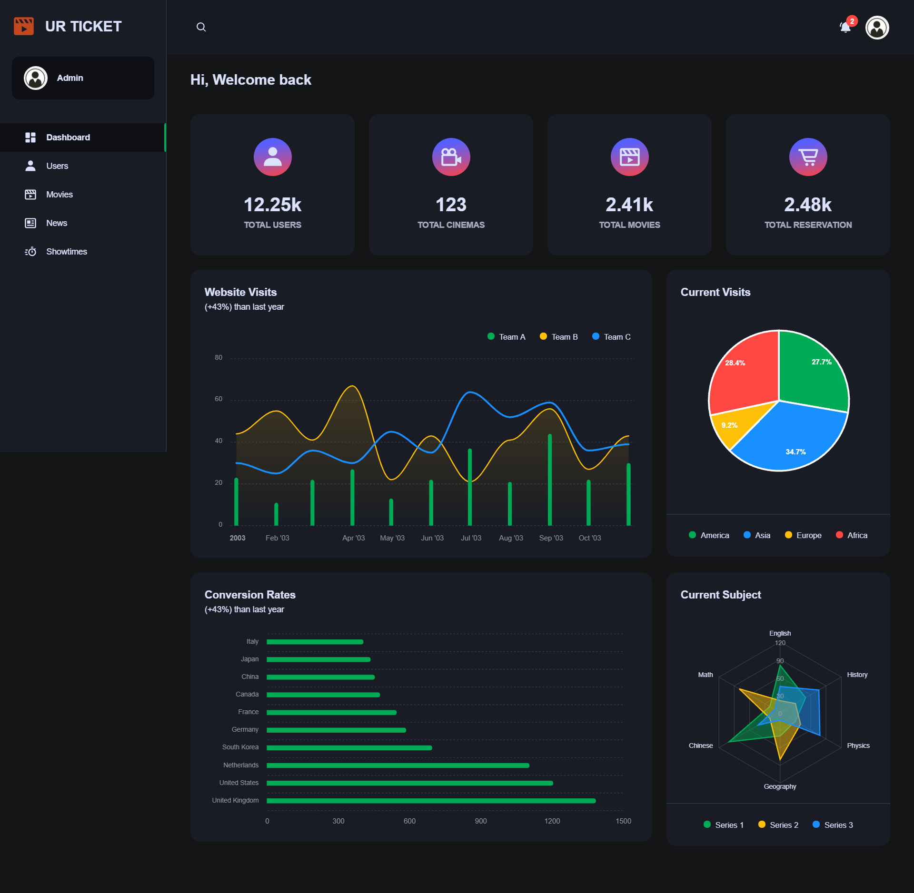
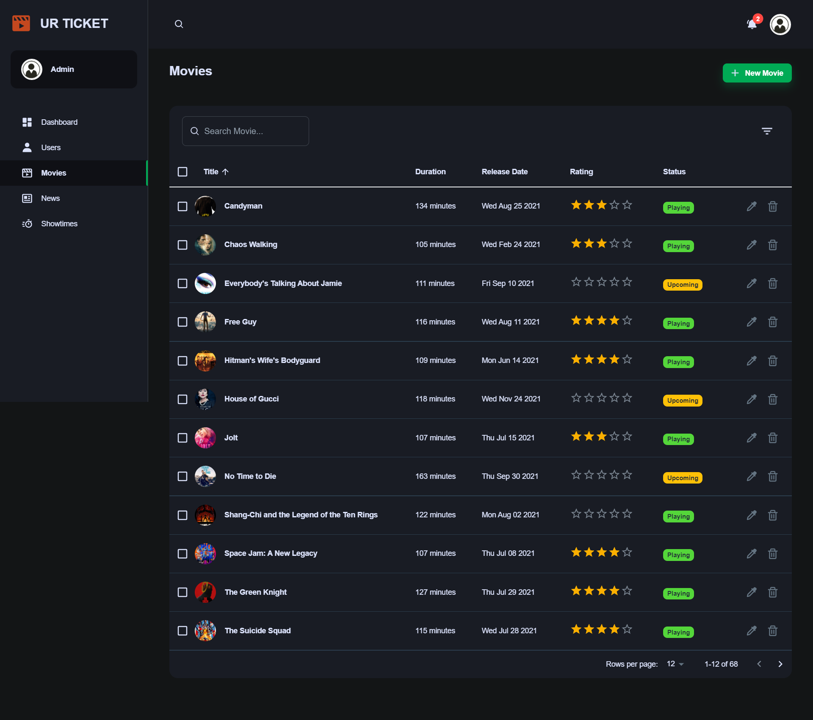

<!-- ALL-CONTRIBUTORS-BADGE:START - Do not remove or modify this section -->


[](https://img.shields.io/github/commit-activity/w/quankhs/urticket-frontend?color=orange)
[](https://www.codefactor.io/repository/github/quankhs/urticket-frontend)
[](https://img.shields.io/github/license/quankhs/urticket-frontend?color=blue)
[](https://hits.seeyoufarm.com)

<!-- ALL-CONTRIBUTORS-BADGE:END -->

# 🍿 Frontend for movie platform `urTicket`

## 😃😃 Do not have responsive design. Feel free if you want to contribute.

## 🚀 Overview

- Frontend for movie platform `urTicket` is a web application that allows users to view, search, review and booking tickets for movies.
- React - A Javascript library for building user interfaces.
- TailwindCSS - Rapidly build modern websites without ever leaving your HTML.
- Material UI - A set of React components that implement Google's Material Design.
- Axios - A Promise based HTTP client for the browser and node.js.
- Redux - A predictable state container for JavaScript apps. With Redux Toolkit you can easily add middleware, enhancers, and it is intended to be the standard way to write Redux logic.
- Docker - Containerization is used for deployment.

## ⚡ Features:

- Authentication: Login, Register, Logout, Forgot password, Reset password.
- List movies: View list of movies playing, movies coming soon
- Discover movies: View list of movies by genre, search movies
- Quick booking tickets for movies
- View movie details: Photos, Trailer, Cast, Reviews
- Add reviews for movies
- View schedule for movies: by theater, by date
- Reading latest news
- Admin manager

## 🔨 In progress:

- Responsive design
- Complete admin manager

## 🚒 Check out my Backend side:

```
https://github.com/QuanKhs/urTicket-backend
```

## 📸 Screenshots

<details>
<summary>📸 Screenshots</summary>














</details>

## 🎥 Video demo

- Google Drive: [GoogleDriveLink](https://drive.google.com/drive/folders/1nC2TtROe4YyAV_xZcb-s3pb79jOtS9di?usp=sharing)

## ✨ Installations

- ### With Docker

1. Install Docker and Docker compose ([from the Docker website](https://www.docker.com/get-started))

2. Fork and clone the urticket-frontend repo ([see Contributing page](CONTRIBUTING.md))
   ```bash
   git clone https://github.com/QuanKhs/urTicket-frontend.git
   ```
3. From the src folder run:

   ```bash
   docker-compose up
   ```

4. Open a browser to see the application running

   ```bash
   http://localhost:3000/
   ```

5. To shutdown the application run:
   ```bash
   docker-compose down
   ```

- ### Without Docker (for development/debugging)

1. Fork and clone the urticket-frontend repo ([see Contributing page](CONTRIBUTING.md))

   ```bash
   git clone https://github.com/QuanKhs/urTicket-frontend.git
   ```

2. Install dependencies & add them to your path:

- [Node.js and npm](https://nodejs.org/en/download/)

3. Start the urticket-frontend server:

   ```bash
   npm install
   npm run start
   ```

## 🏳‍🌈 Release


## 🥇Contributors

<table>
  <tr>
    <td align="center"><a href="https://github.com/quankhs"><br /><sub><b>Quankhs</b></sub></a><br />
      <a href="#" title="Ideas">💡</a>
      <a href="#" title="Coding">👨‍💻</a>
      <a href="#" title="Planning">💭</a>
      <a href="#" title="Fix bugs">🐛</a>
      <a href="#" title="Scares">😩</a>
      <a href="#" title="Angry">👿</a>
    </td>
  </tr>
</table>

## 🙏 References

- React official documents: [https://reactjs.org/](https://reactjs.org/)
- Redux Tool-kit official documents: [https://redux-toolkit.js.org/](https://redux-toolkit.js.org/)
- TailwindCSS official documents: [https://tailwindcss.com/](https://tailwindcss.com/)
- Minimal UI Kit : [https://docs-minimals.vercel.app/](https://docs-minimals.vercel.app/)

## 🤝 Contacts and social networks

[](https://facebook.com/quanphamluong)
[](https://github.com/quankhs)
[](mailto:quanphamluong@gmail.com)
[](https://www.linkedin.com/in/quankhs/)
